# Microservices Architecture: Order-Service, Inventory-Service, and Billing-Service

## Overview

This project showcases the implementation of a **Microservices Architecture** with a focus on **Apache Kafka** for inter-service communication. The architecture consists of three independent microservices:

1. **Order-Service**: Produces Kafka messages with order details when an API endpoint is triggered.
2. **Inventory-Service**: Consumes Kafka messages and updates inventory based on orders.
3. **Billing-Service**: Consumes Kafka messages and creates billing records for each order.

Each microservice is designed to handle its responsibilities independently, ensuring scalability, modularity, and maintainability.

## Technologies Used

- **Spring Boot**
    - Spring Web
    - Spring Data JPA
    - Spring Kafka
- **Kafka** for message brokering
- **MySQL** as the database

---

## Services Overview

### 1. Order-Service

- **Responsibilities**:
    - Acts as a Kafka producer.
    - Exposes an endpoint to place orders. `http://localhost:8080/orders/place-order`
    - Publishes order details as messages to the Kafka topic `order-topic`.
- **Dependencies**:
    - `spring-boot-starter-web`
    - `spring-boot-starter-data-jpa`
    - `spring-kafka`

### 2. Inventory-Service

- **Responsibilities**:
    - Acts as a Kafka consumer.
    - Updates the inventory table based on orders placed.
- **Dependencies**:
    - `spring-boot-starter-data-jpa`
    - `spring-kafka`


### 3. Billing-Service

- **Responsibilities**:
    - Acts as a Kafka consumer.
    - Saves billing records for each order in the billing table.
- **Dependencies**:
    - `spring-boot-starter-data-jpa`
    - `spring-kafka`

---

## Steps to Run the Project Locally

### Prerequisites

1. Install **Kafka** and ensure it is running.
    - Start the Kafka broker and Zookeeper.
      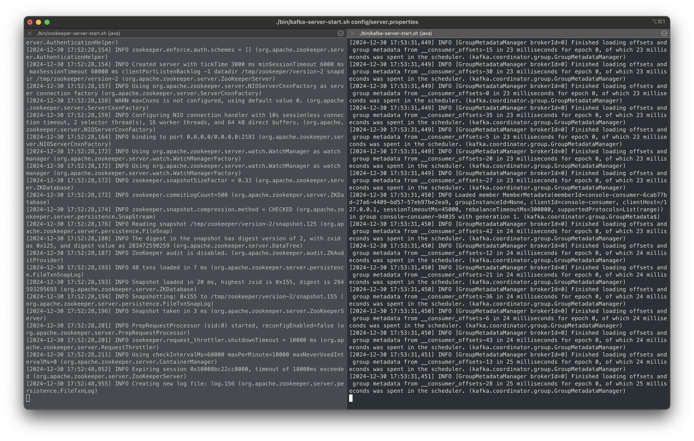

2. Install **Java 17** or higher.
3. Install **Maven** for dependency management.
4. Install **MySQL** and configure the database for each service.

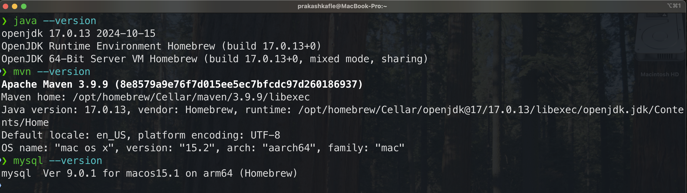

---

### Create database `products_database` in your mysql

- Using DBeaver for working with database

```bash
    CREATE DATABASE products_database;
```

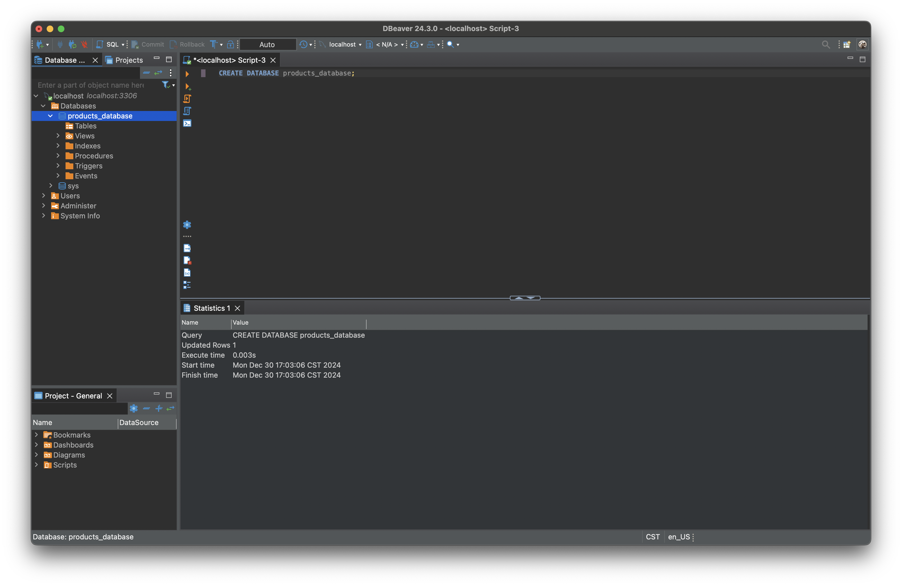

## Before running, provide database credentials
 
Navigate to `src/main/resources/application.properties` and make the below changes for each service.

```properties
spring.datasource.username = <your-username>
spring.datasource.password = <your-password>

spring.jpa.generate-ddl = true
spring.jpa.hibernate.ddl-auto = update
```
Replace `<your-username>` and `<your-password>` with your db credentials 

---

### Running Each Service


1. **Order-Service**:

    - Navigate to the `order-service` directory.
    - Run:
      ```bash
      mvn clean install
      ```
      ```
      mvn spring-boot:run
      ```
      Once the application is up and running, verify the table `orders' is created. Refresh the database.
<br>

   - API Endpoint:
      `http://localhost:8080/orders/place-order`
   
        - Open Postman, and test the endpoint by providing the below request body.

      ```
      {
          "productName": "iPhone 14",
          "quantity": 1,
          "price": 999.99
      }
      ```

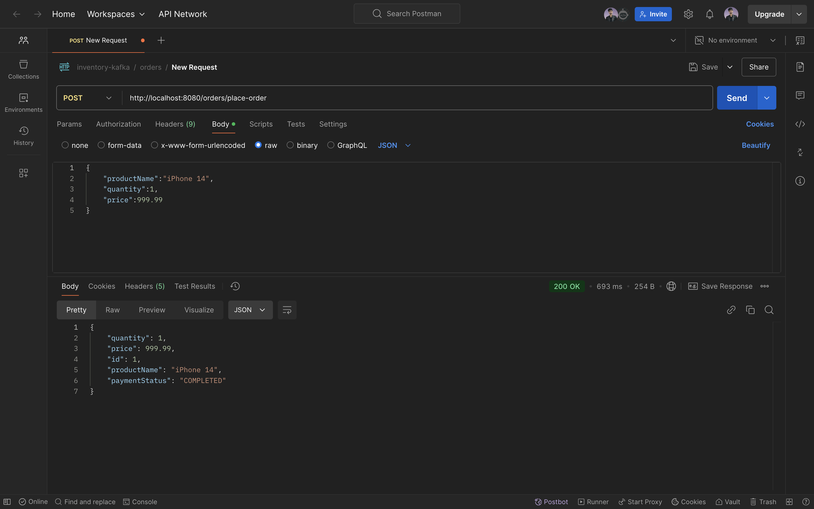

Verify the logs

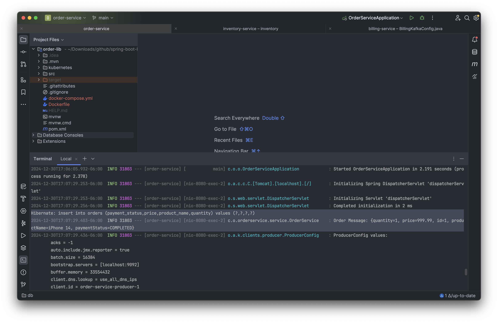

Verify the table `orders` is updated.

   ```bash
    USE products_database;
   ```
   ```bash
   SELECT * FROM orders o ;
   ```

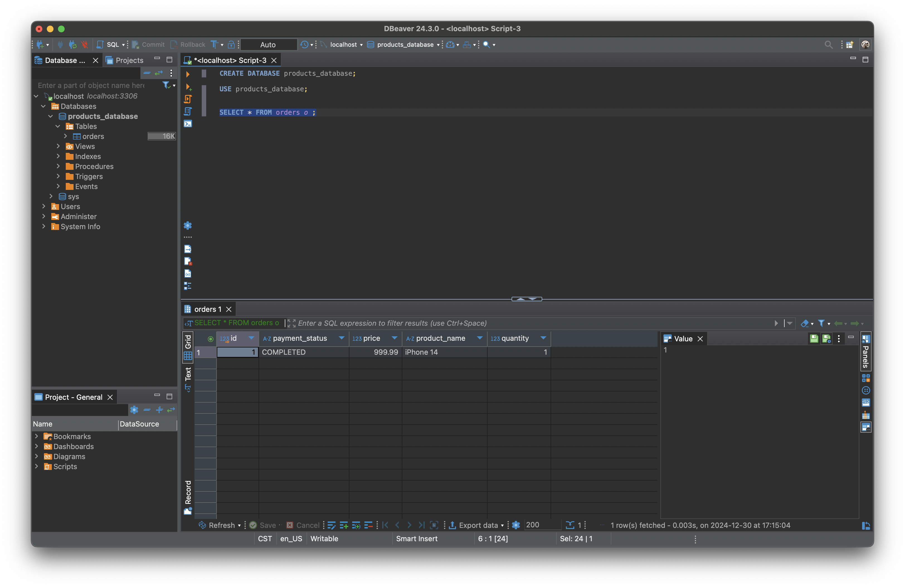

Verify the kafka-topic. After POST request is made, the service produce the message in topic `order-topic`

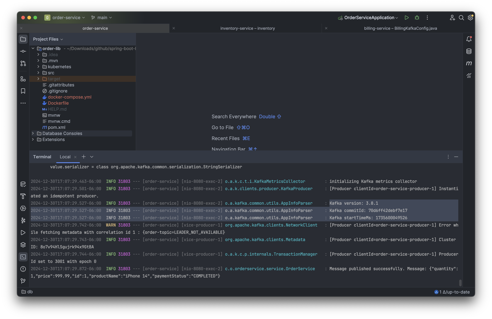

```bash
    ./bin/kafka-topics.sh --bootstrap-server localhost:9092 --list
```
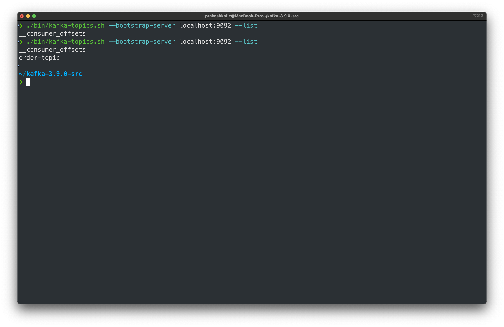

### <i> IF YOU HAVE COME THIS FAR, YOUR APP IS CONNECTING WITH KAFKA AND MYSQL </i>


2. **Inventory-Service**:
 Inventory Service is a `consumer` service that works with table `inventory` which update the table when message is consumed from topic `order-topic` produced by `order-service`

<h3> Before running this service, create a table <i>inventory</i> and insert some data to work with. Use the following queries.</h3>

```bash
CREATE TABLE inventory (
                           id INT PRIMARY KEY,
                           product_name VARCHAR(255) NOT NULL,
                           available_quantity INT NOT NULL,
                           price DECIMAL(10, 2) NOT NULL
);
```
```bash
INSERT INTO inventory (id, product_name, available_quantity, price)
VALUES
    (1, 'iPhone 14', 50, 999.99),
    (2, 'Samsung Galaxy S23', 50, 999.99),
    (3, 'Google Pixel 7', 50, 999.99);
    
```

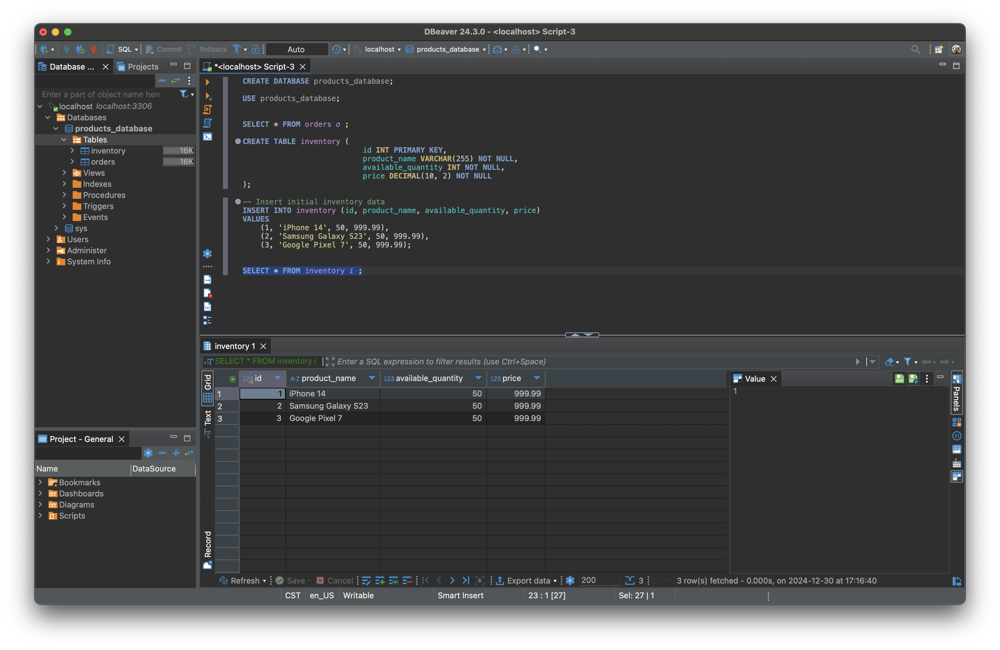

- Navigate to the `inventory-service` directory.
    - Run:
      ```bash
      mvn clean install
      ```
      
      ```bash
      mvn spring-boot:run
      ```
      
    - Verify the logs. The consumer is created.
  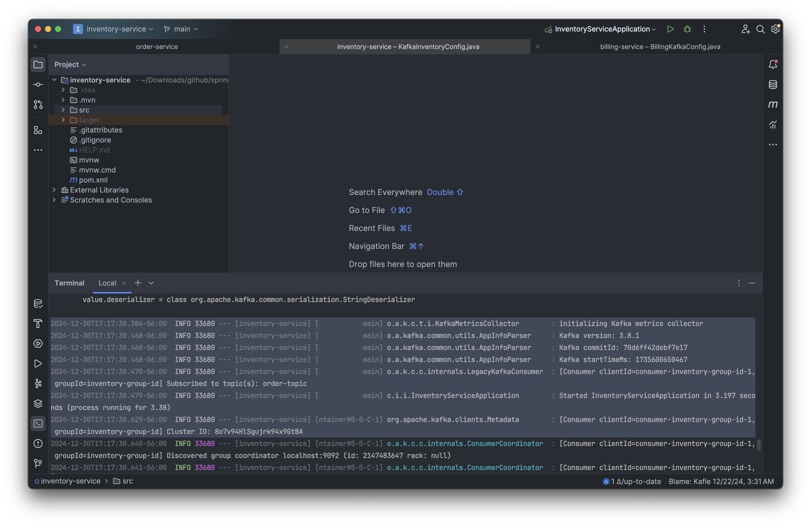
    - Verify in kafka. The consumer group `inventory-group-id` is created.
  ```bash
    ./bin/kafka-consumer-groups.sh --bootstrap-server localhost:9092 --list
  ```
    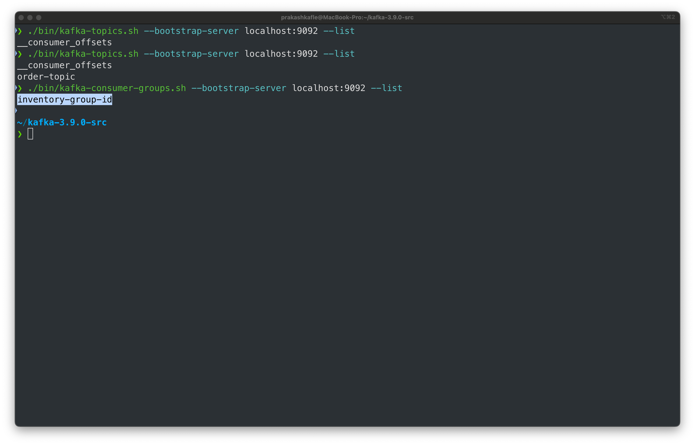


  
After `inventory-service` is up and running, run the `billing-service`

- Inventory gets updated automatically when an order is placed.

3. **Billing-Service**:

    - Navigate to the `billing-service` directory.
    - Run:
      ```bash
      mvn clean install
      ```
      ```bash
      mvn spring-boot:run
      ```

    - Verify the logs. The consumer is created.
    - Verify in kafka. The consumer group `billing-group-id` is created.
  ```bash
    ./bin/kafka-consumer-groups.sh --bootstrap-server localhost:9092 --list
  ```
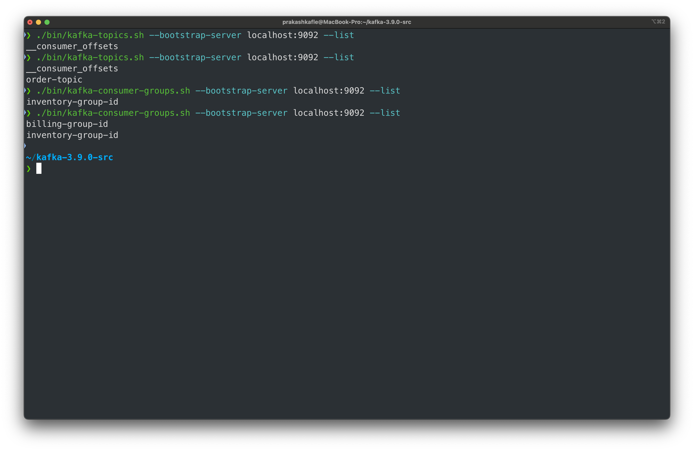


   <b>Billing table table is automatically created when application is up and running.</b>

```bash
SELECT * FROM billing b ;
```

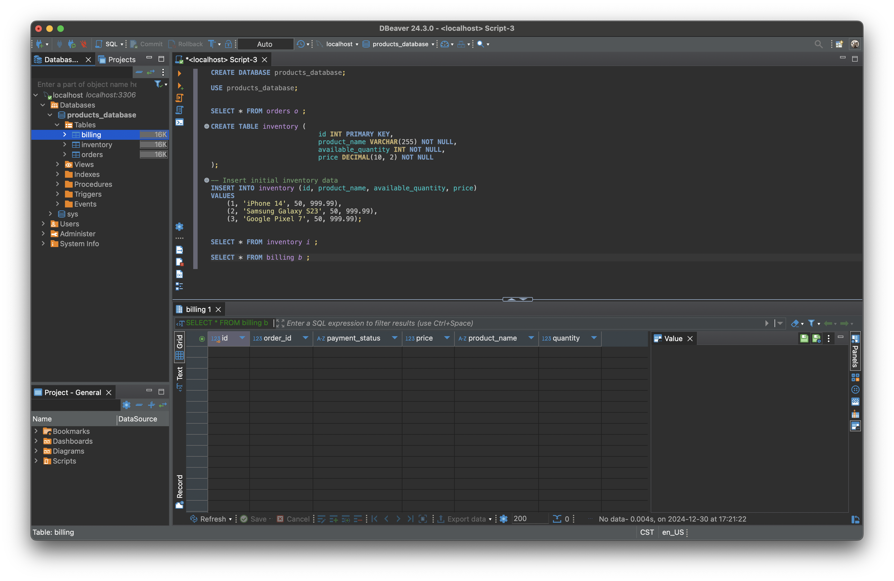

---

---
<h3>Once all three services is up and running, hit POST request api to produce message.</h4>
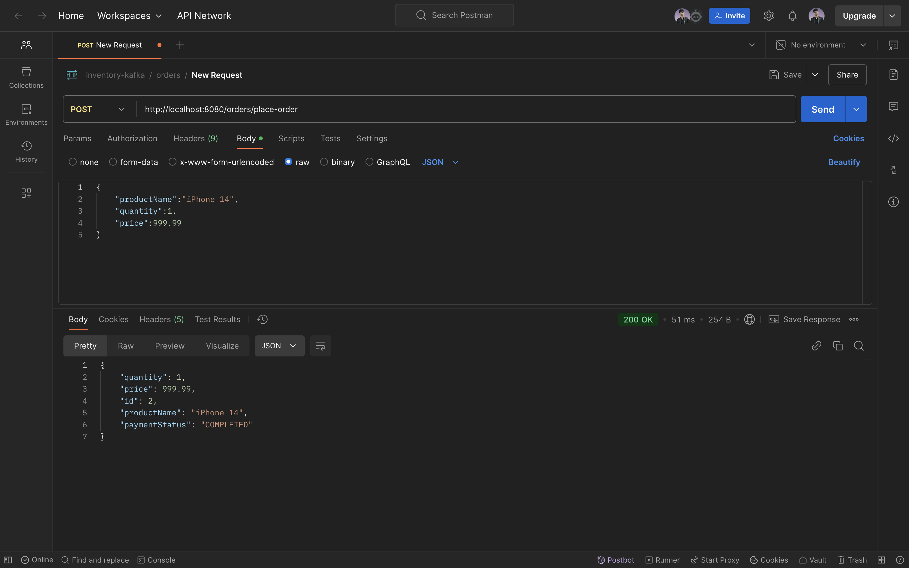
<h4>Verify all service logs</h4>
- `order-service: Produce the message and update the orders table`


<br>

- `inventory-service: Consume the message and update the inventory table`

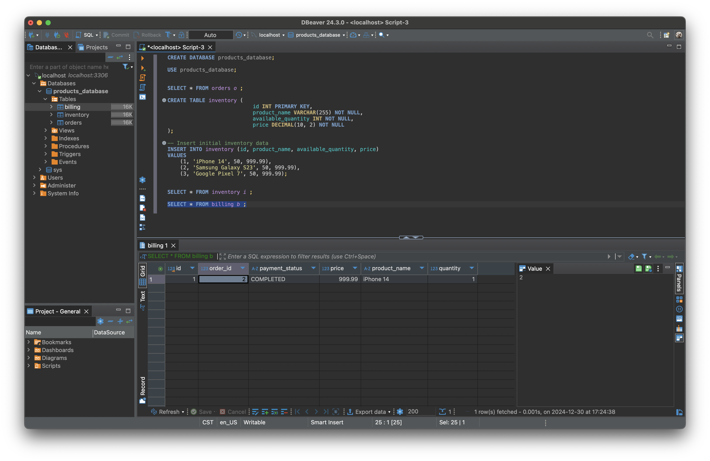
  <br>
- `billing-service: Consume the message and update the billing table`
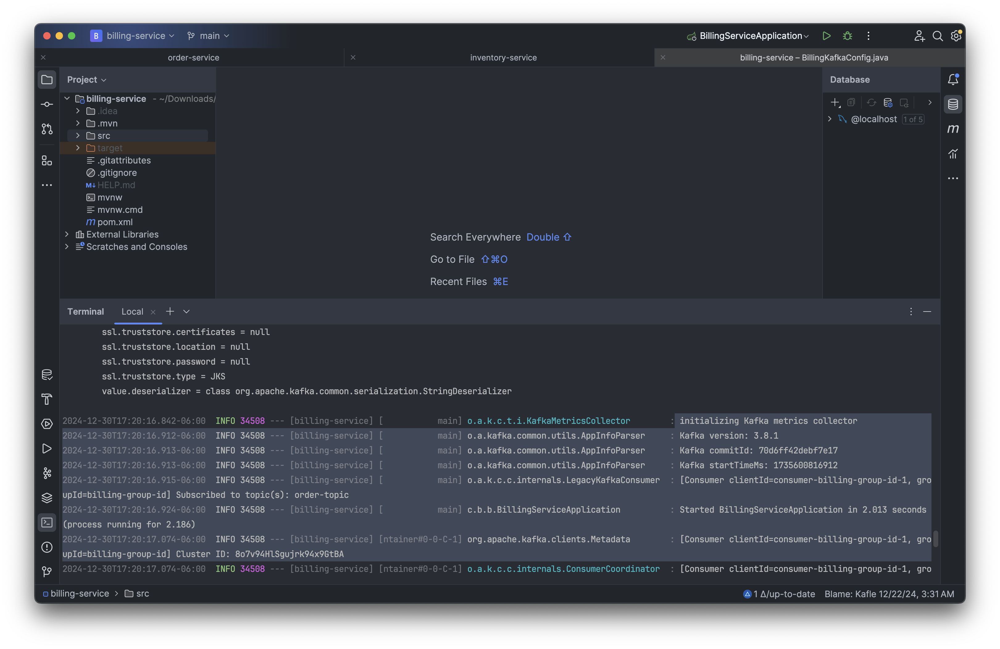


<br>

<h4>Verify the messages in kafka-console</h4>

```bash
./bin/kafka-console-consumer.sh --bootstrap-server localhost:9092 --topic order-topic --from-beginning
```
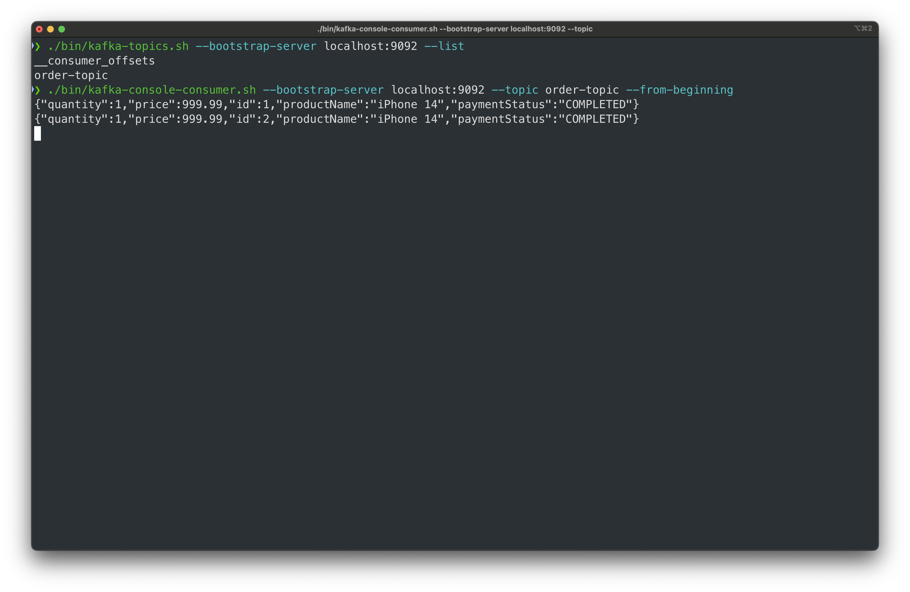

---

---

## Database Details

Each service uses MySQL as the database. Ensure the database and tables are created before running the services.

- **Order-Service**:

    - Table: `orders`
    - Schema: Automatically created when the application runs.

- **Inventory-Service**:

    - Table: `inventory`
    - Schema: Use the provided schema.sql file located in src/main/resources to create and populate the table.

- **Billing-Service**:

    - Table: `billing`
    - Schema: Automatically created when the application runs.

---

## Kafka Configuration

All Kafka properties are configured in the Java configuration class for each service. There is no need for Kafka-related settings in the `application.properties` file.

- **Topic**: `order-topic`
- **Producer**: Order-Service
- **Consumers**: Inventory-Service, Billing-Service

---

## Future Enhancements

1. Implement API Gateway for routing and authentication.
2. Add Swagger documentation for REST APIs.
3. Implement distributed tracing using Zipkin or Jaeger.
4. Add resilience patterns with Circuit Breakers using Resilience4j.

---

## Tools and Environment

- **Java**:
  ```
  java 17.0.1 2021-10-19 LTS
  Java(TM) SE Runtime Environment (build 17.0.1+12-LTS-39)
  Java HotSpot(TM) 64-Bit Server VM (build 17.0.1+12-LTS-39, mixed mode, sharing)
  ```
- **Maven**:
  ```
  Apache Maven 3.9.9
  ```
- **Kafka**:
  ```
  3.9.0
  ```
- **Database**: MySQL
- **OS**: macOS (Apple Silicon)

